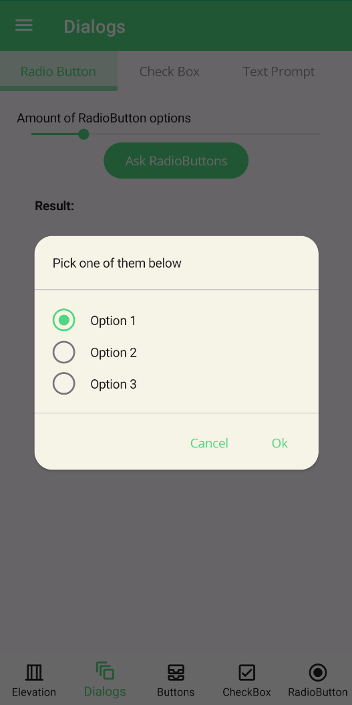
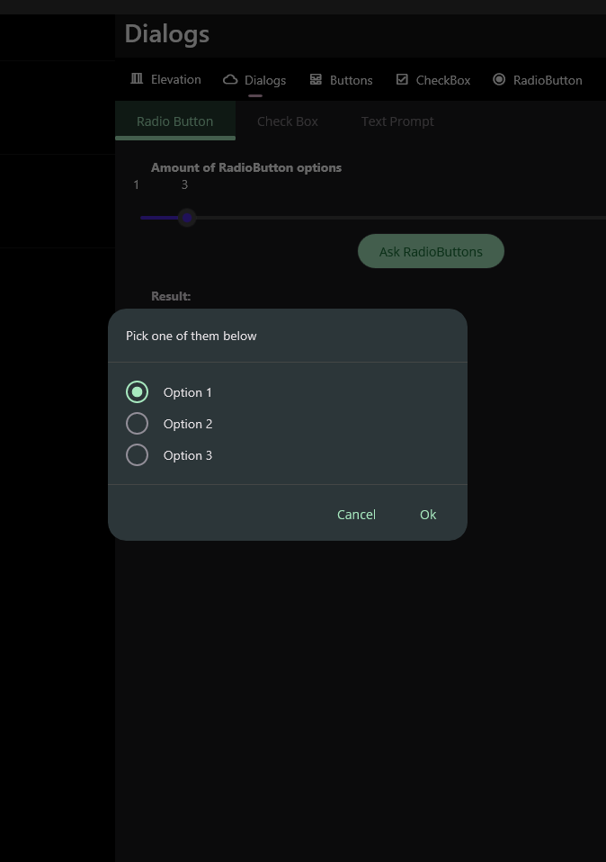
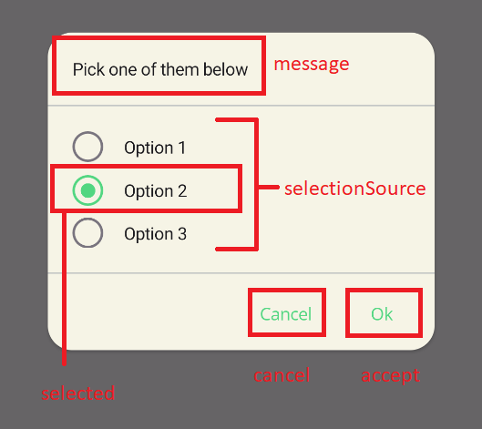
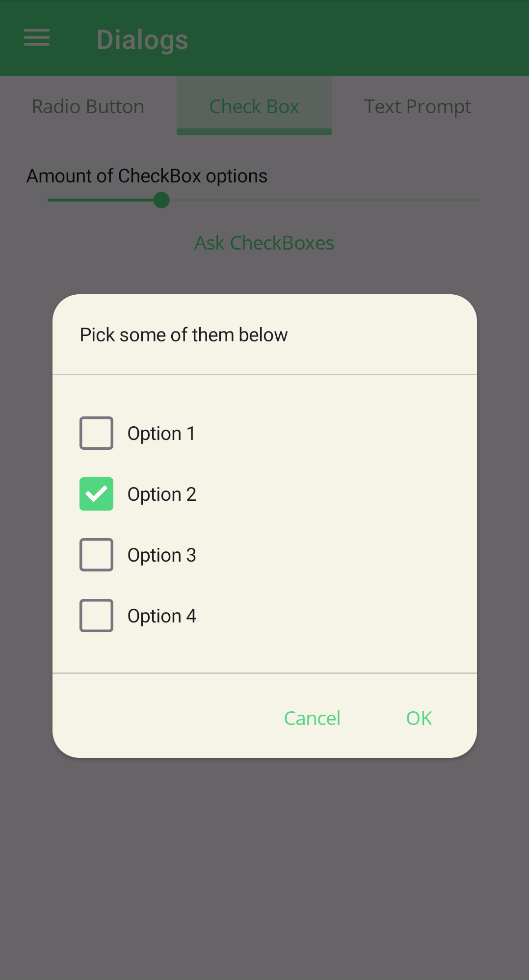
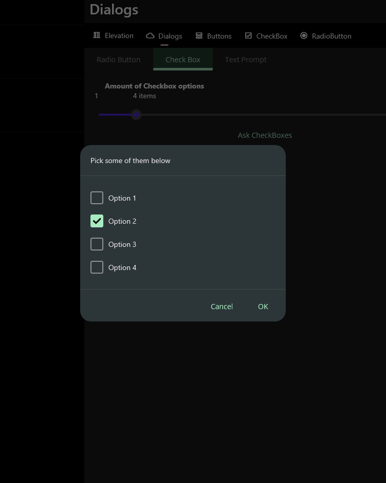
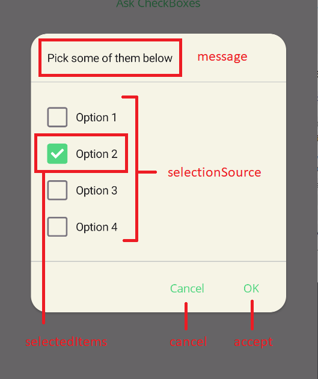
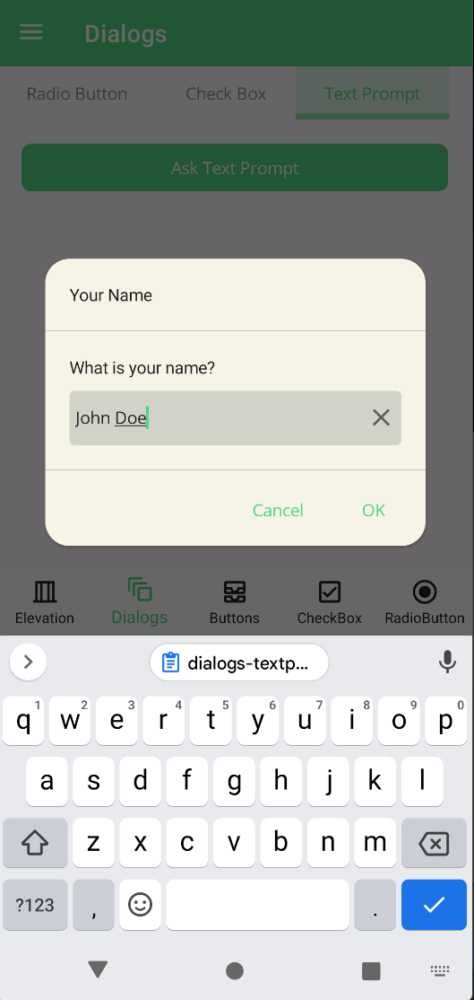
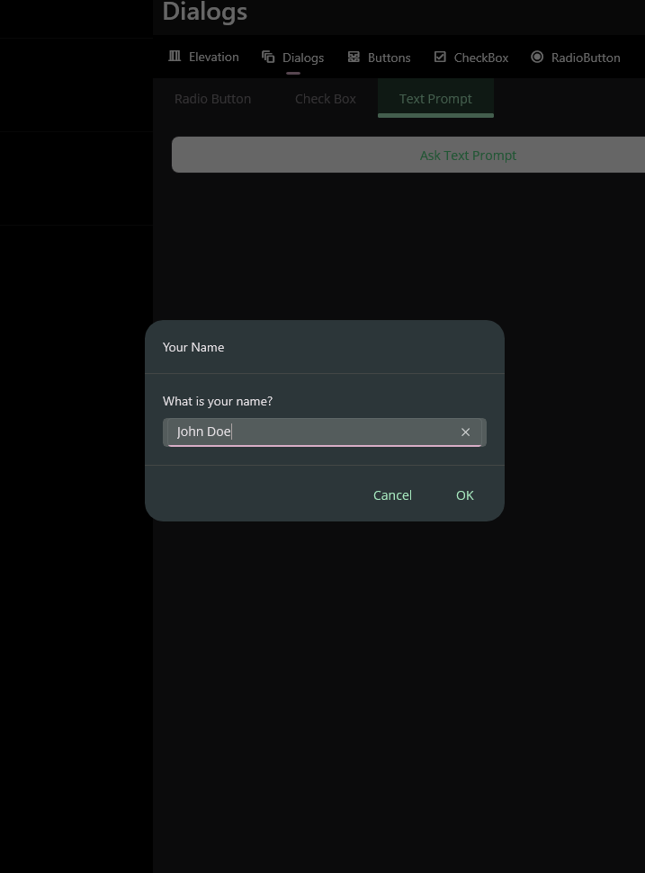

# Dialogs
Dialogs are a great way to get the user to make a decision or enter some information. They are also a great way to display information to the user. A set of pre-built dialogs are provided by UraniumUI such as asking multiple or single selection, confirmation and text input. UraniumUI provides an abstraction layer for dialogs with `IDialogService`. UraniumUI has 2 different popups implementations which are [Community Toolkit](https://github.com/CommunityToolkit/Maui) and [Mopups](https://github.com/LuckyDucko/Mopups).

<center>

</center>

You should pick one of them and add it to your project. UraniumUI will use the popup implementation that you added to your project. If you don't add any popup implementation, UraniumUI will use Modal pages instead of popups.

Available packages
- `UraniumUI.Dialogs.CommunityToolkit`
- `UraniumUI.Dialogs.Mopups`

## CommunityToolkit

1. Install [UraniumUI.Dialogs.CommunityToolkit](https://www.nuget.org/packages/UraniumUI.Dialogs.CommunityToolkit)

    ```bash
    dotnet add package UraniumUI.Dialogs.CommunityToolkit
    ```

2. Add required services in `MauiProgram.cs`

    ```csharp
    builder.Services.AddCommunityToolkitDialogs();
    ```

## Mopups

1. Install [UraniumUI.Dialogs.Mopups](https://www.nuget.org/packages/UraniumUI.Dialogs.Mopups)

    ```bash
    dotnet add package UraniumUI.Dialogs.Mopups
    ```

2. Configure Mopups in `MauiProgram.cs`

    ```csharp
    builder
        .UseMauiApp<App>()
        .UseUraniumUI()
        .UseUraniumUIMaterial()
        .ConfigureMopups() // 👈 Add this line
        // ...
    ```

3. Add required services in `MauiProgram.cs`

    ```csharp
    builder.Services.AddMopupsDialogs();
    ```


## Types
There are 4 types of dialogs in UraniumUI package. They are: `CheckBox Prompt`, `RadioButton Prompt`, `Confirmation` and `Text Prompt`. They are implemented as extension methods and `IDialogService` implementation. You can use them as extension method for any **Page** or you can use then view injecting `IDialogService` to your class.


**Extension Method**
```csharp
public partial class MainPage : ContentPage
{
    public MainPage()
    {
        InitializeComponent();
    }

    private async void Button_Clicked(object sender, EventArgs e)
    {
        var result = await this.DisplayCheckBoxPromptAsync("Title", new []{ "Option 1", "Option 2", "Option 3"});
    }
}
```

**IDialogService**

```csharp
public partial class MainPage : ContentPage
{
    public IDialogService DialogService { get; }
    public MainPage(IDialogService dialogService)
    {
        InitializeComponent();
        DialogService = dialogService;
    }

    private async void Button_Clicked(object sender, EventArgs e)
    {
        var result = await DialogService.DisplayCheckBoxPromptAsync("Title", new []{ "Option 1", "Option 2", "Option 3"});
    }
}
```

> Injecting `IDialogService` is highly recommended. It'll make your code more testable and makes dialogs libray easily swappable.

### RadioButton Prompt
RadioButton prompt can be used to get a single selection input from user. It returns the selected option. It can be used with strings or objects. If you use objects, you can use `DisplayMember` parameter to specify the property of the object to be displayed or your object should override `ToString()` method.


#### Usage
The easiest way to use RadioButton prompt is to pass a string array to it. It will return the selected option as a string.

```csharp
private async void Button_Clicked(object sender, EventArgs e)
{
    var result = await this.DisplayRadioButtonPromptAsync(
            "Pick some of them below",
            new [] {"Option 1", "Option 2", "Option 3"});
}
```

| Light | Dark |
| --- | --- |
|  |  |


#### Parameters

`DisplayRadioButtonPromptAsync` method has 6 parameters. They are:

- `message`: Message of the dialog. It'll be rendered top of the dialog.
- `selectionSource`: Selection source of the dialog. It can be a string collection or an object collection. If you use objects, you can use `displayMember` parameter to specify the property of the object to be displayed or your object should override `ToString()` method.
- `selected`: Selected item of the dialog. It'll be automatically selected when dialog is shown.
- `accept`: Accept button text of the dialog. It'll be rendered as the accept button text.
- `cancel`: Cancel button text of the dialog. It'll be rendered as the cancel button text.
- `displayMember`: Display member of the object. It'll be used to specify the property of the object to be displayed or your object should override `ToString()` method.



```csharp
private async void Button_Clicked(object sender, EventArgs e)
{
    var options = new List<MyOption>()
    {
        new MyOption() { Name = "Option 1", Description = "Description 1" },
        new MyOption() { Name = "Option 2", Description = "Description 2" },
        new MyOption() { Name = "Option 3", Description = "Description 3" },
    };
    var result = await this.DisplayRadioButtonPromptAsync(
            "Pick some of them below",
            options,
            options[1],
            "OK",
            "Cancel",
            "Name");

    await this.DisplayAlert("Result", result.Name, "OK");
}
```

### CheckBox Prompt
CheckBox prompt can be used to get a multiple selection input from user. It returns the selected options. It can be used with strings or objects. If you use objects, you can use `DisplayMember` parameter to specify the property of the object to be displayed or your object should override `ToString()` method.


| Light | Dark |
| --- | --- |
|  |  |

#### Usage
The easiest way to use CheckBox prompt is to pass a string array to it. It will return the selected options as a string array.

```csharp
private async void Button_Clicked(object sender, EventArgs e)
{
    var result = await this..DisplayCheckBoxPromptAsync(
            "Pick some of them below",
            new [] {"Option 1", "Option 2", "Option 3", "Option 4",});
}
```

#### Parameters

`DisplayCheckBoxPromptAsync` method has 6 parameters. They are:
- `message`: Message of the dialog. It'll be rendered top of the dialog.
- `selectionSource`: Selection source of the dialog. It can be a string collection or an object collection. If you use objects, you can use `displayMember` parameter to specify the property of the object to be displayed or your object should override `ToString()` method.
- `selectedItems`: Selected items of the dialog. They'll be automatically selected when dialog is shown.
- `accept`: Accept button text of the dialog. It'll be rendered as the accept button text.
- `cancel`: Cancel button text of the dialog. It'll be rendered as the cancel button text.
- `displayMember`: Display member of the object. It'll be used to specify the property of the object to be displayed or your object should override `ToString()` method.



```csharp
private async void Button_Clicked(object sender, EventArgs e)
{
    var options = new List<MyOption>()
    {
        new MyOption() { Name = "Option 1", Description = "Description 1" },
        new MyOption() { Name = "Option 2", Description = "Description 2" },
        new MyOption() { Name = "Option 3", Description = "Description 3" },
        new MyOption() { Name = "Option 3", Description = "Description 4" },
    };

    var result = await this.DisplayCheckBoxPromptAsync(
            "Pick some of them below",
            options,
            new [] { options[1] },
            "OK",
            "Cancel",
            "Name");

    await this.DisplayAlert("Result", string.Join(", ", result.Select(x => x.Name)), "OK");
}
```

### Text Prompt
Text prompt can be used to get a text input from user. It returns the entered text. All parameters are same with MAUI default `DisplayPromptAsync` method.

| Light | Dark |
| --- | --- |
|  |  |

```csharp
private async void Button_Clicked(object sender, EventArgs e)
{
    var result = await this.DisplayTextPromptAsync("Your Name", "What is your name?", placeholder: "Uvuvwevwevwe...Osas");

    await DisplayAlert("Result:", result, "OK");
}
```

